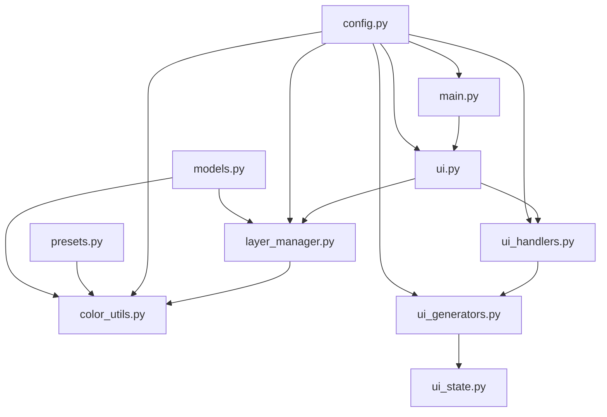

# MS Color Generator

<div align="center">

詳細マニュアルです、AIが勝手に書いてます、だいたいあってるところはすごいですね！


**🎨 レイヤー画像の動的カラーリングツール**

[](https://python.org)
[](https://gradio.app)
[](LICENSE)
[](https://github.com/jinnjinnjinn/ms-color-generator)

*プラモデル・ガンプラの塗装色設計をインテリジェントにサポート*

[🚀 クイックスタート](#クイックスタート) | [📖 使用方法](#使用方法) | [⚙️ 設定](#設定詳細) | [🔧 トラブルシューティング](#トラブルシューティング)

</div>

---

## 📋 目次

- [概要](#概要)
- [✨ 主な機能](#主な機能)
- [🚀 クイックスタート](#クイックスタート)
- [📁 プロジェクト構造](#プロジェクト構造)
- [📖 使用方法](#使用方法)
- [⚙️ 設定詳細](#設定詳細)
- [🎨 カラーパレット機能](#カラーパレット機能)
- [🔧 トラブルシューティング](#トラブルシューティング)
- [🤝 コントリビューション](#コントリビューション)
- [📄 ライセンス](#ライセンス)

## 概要

MS Color Generatorは、レイヤー化されたPNG画像の色を動的に変更するための高機能ツールです。特にガンプラ・プラモデルの塗装色設計に特化しており、色彩理論に基づいたインテリジェントなカラーパレット生成機能を提供します。

### 🎯 主な用途

- **ガンプラ・プラモデル塗装設計**: MS（モビルスーツ）などの複数パーツの配色検討
- **キャラクターデザイン**: アニメ・ゲームキャラクターの色変更
- **UIデザイン**: ウェブサイト・アプリのカラースキーム検討
- **グラフィックデザイン**: ロゴ・イラストの配色バリエーション作成

## ✨ 主な機能

### 🎨 動的カラーリング機能
- **リアルタイム色変更**: レイヤーごとの色をリアルタイムで変更
- **グループ管理**: 複数レイヤーを同一色グループとして管理
- **ワンクリック編集**: 画像をクリックしてレイヤーを直接選択・編集

### 🤖 インテリジェントカラー生成
- **6つのプリセット**: ビビッド、ペール、ダル、アースカラー、ライトグレイッシュ、モノクロ
- **HSV制御**: 色相・彩度・明度の詳細制御
- **色相距離制御**: 生成色間の最小距離を指定
- **等間隔生成**: 色相環上に等間隔で色を配置

### 🖼️ マルチパターン表示
- **4パターン同時生成**: 異なる配色を4つ同時に比較
- **ギャラリー表示**: 横並びで配色を一覧表示
- **ワンクリック選択**: ギャラリーから配色を選択してメイン表示に適用

### 🌈 高度なカラーツール
- **画像からの色抽出**: アップロード画像からカラーパレットを抽出
- **K-Meansクラスタリング**: 主要色の自動抽出
- **色相補完**: 抽出色に調和する補色を自動生成
- **HSV一括調整**: 全色の色相・彩度・明度を一括シフト

### 💾 保存・エクスポート機能
- **タイムスタンプ保存**: 自動でタイムスタンプ付きファイル名で保存
- **環境対応**: ローカル・Hugging Face Spaces両対応
- **設定保存**: グループ設定をテキストファイルで管理（実装してない）
- **バックアップ機能**: ソースコードの自動バックアップ（開発者向け）

## 🚀 クイックスタート

### 📋 前提条件

- **Python 3.8以上**
- **4GB以上のRAM推奨**（無くても行ける！）
- **モダンウェブブラウザ** (Chrome, Firefox, Safari, Edge)（何がモダンなんだか）

### 📥 インストール

1. **リポジトリのクローン**
   ```bash
   git clone https://github.com/jinnjinnjinn/ms-color-generator.git
   cd ms-color-generator
   ```

2. **依存関係のインストール**
   ```bash
   pip install -r requirements.txt
   ```

3. **レイヤーファイルの準備**
   ```bash
   mkdir layer
   # layer1.png, layer2.png, layer3.png... をlayerフォルダに配置
   ```

4. **アプリケーションの起動**
   ```bash
   python main.py
   ```

5. **ブラウザでアクセス**
   - 自動でブラウザが開きます
   - または `http://localhost:7860` にアクセス

### 🎯 5分でできる初回セットアップ

1. **サンプルレイヤーの作成**
   - 透明背景のPNG画像を作成
   - 色を変えたい部分を**マゼンタ色(#ff00ff)**で塗りつぶし
   - `layer/layer1.png`として保存
   - `layer/layer2.png`として保存
   - 以下同・・・

2. **グループ設定（オプション）**
   ```
   # grouping.txt の例
   1,2,3:#ff0000    # レイヤー1,2,3を赤グループ
   4,5:#00ff00      # レイヤー4,5を緑グループ
   ```

3. **動作確認**
   - アプリ起動後、「ビビッド」プリセットをクリック
   - 「現在のパラメーターで4配色パターン生成」をクリック
   - 4つの配色パターンが表示されることを確認

## 📁 プロジェクト構造

```
ms-color-generator/
├── 🎯 main.py                 # アプリケーションエントリポイント
├── ⚙️ config.py              # 統合設定ファイル
├── 📊 models.py              # データモデル定義
├── 🖼️ layer_manager.py       # レイヤー処理エンジン
├── 🎨 color_utils.py         # 色処理ユーティリティ
├── 🖥️ ui.py                  # メインUIコンポーネント
├── 🎮 ui_handlers.py         # イベントハンドラー
├── 🎲 ui_generators.py       # パターン生成器
├── 💾 ui_state.py           # 状態管理
├── 🛠️ ui_utils.py           # UIユーティリティ
├── 🎛️ presets.py            # カラープリセット定義
├── 📁 layer/                # レイヤーファイル格納
│   ├── layer1.png
│   ├── layer2.png
│   └── ...
├── 📤 output/               # 生成画像保存先
├── 📋 grouping.txt         # レイヤーグループ設定
├── 📄 requirements.txt     # Python依存関係
├── 🌐 app.py              # Hugging Face Spaces用
└── 📖 README.md           # このファイル
```

### 🗂️ 主要ファイルの役割

| ファイル | 役割 | 重要度 |
|---------|------|--------|
| `main.py` | アプリ起動・初期化 | ⭐⭐⭐ |（mainで起動って珍しい？）
| `ui.py` | メインUI・Color Extractor | ⭐⭐⭐ |
| `layer_manager.py` | レイヤー合成・色処理 | ⭐⭐⭐ |
| `config.py` | 全設定の統合管理 | ⭐⭐ |
| `ui_generators.py` | パターン生成ロジック | ⭐⭐ |
| `color_utils.py` | 色変換・生成アルゴリズム | ⭐⭐ |
| `grouping.txt` | レイヤーグループ設定 | ⭐ |

## 📖 使用方法

### 🎨 基本ワークフロー

#### 1️⃣ レイヤーファイルの準備

```bash
# レイヤーファイルの命名規則
layer/
├── layer1.png    # 第1レイヤー（例：胴体）
├── layer2.png    # 第2レイヤー（例：頭部）
├── layer3.png    # 第3レイヤー（例：武器）
└── layer4.png    # 第4レイヤー（例：エフェクト）
```

**🎯 重要な注意事項:**
- **必ずマゼンタ色(#ff00ff)** を色変更対象として使用
- 透明背景(RGBA PNG)で保存（しなくてもいいんだなこれが）
- ファイル名は `layer[数字].png` の形式

#### 2️⃣ グループ設定の作成

```bash
# grouping.txt の詳細記法
# レイヤー番号:初期色コード

# 例1: ガンダムカラー
1,5,6,7,8,9,12,18,19,21,22,23,24,26:#afb998  # メイン（白系）
2,16,17:#7a8268                               # サブ1（青系）
3,4,11,13,15:#424539                          # サブ2（赤系）
10,14,20,25:#d0d3c9                           # アクセント（黄系）

# 例2: シンプル設定
1,2,3:#ff0000     # 赤グループ
4,5:#00ff00       # 緑グループ
6:#0000ff         # 青グループ
```

#### 3️⃣ 色の生成と調整

##### 🎲 プリセットを使用した生成
```
1. プリセットボタンをクリック（ビビッド、ペール等）
2. 「現在のパラメーターで4配色パターン生成」をクリック
3. 4つのパターンをギャラリーで比較
4. 気に入ったパターンをクリックして選択
```

##### 🔧 カスタムパラメータでの生成
```
1. 彩度基準・範囲を調整（0-100%）
2. 明度基準・範囲を調整（0-100%）
3. 色相中心・範囲を調整（0-360°）
4. 色相等間隔生成をON/OFF
5. 最小色相距離を設定（0-180°）
6. 「現在のパラメーターで4配色パターン生成」をクリック
```

#### 4️⃣ 手動調整

##### 🎨 個別色の調整
```
1. カラーピッカーで個別の色を変更（できます）
2. HSVシフトスライダーで全色を一括調整（全色というか全グループというか全レイヤー）
3. 画像をクリックしてレイヤーを直接選択（して、そのレイヤーのグループを変更したり別のグループを作ったりできる！）
4. グループの変更・新規作成
```

##### 🖼️ 画像からの色抽出
```
1. 「画像をアップロード」に参考画像をドロップ
2. 自動で色が抽出・表示される
3. 使用したい色にチェックを入れる
4. 「抽出した色で4配色パターンを生成」をクリック
```

#### 5️⃣ 保存とエクスポート

```
1. 「メイン表示を保存」をクリック
2. output/フォルダにタイムスタンプ付きで保存
3. Hugging Face Spaces環境では自動ダウンロード（ではない・・・あとで改善する）
```

### 🎮 高度な機能

#### 🌈 HSV変化パターンの生成

```python
# 色相違いパターンの生成
1. 「現在の色の色相違いを4パターン生成」をクリック
2. 等間隔モード: -45°, -15°, +15°, +45°の変化
3. ランダムモード: ±180°範囲でランダム変化
```

#### 🎯 レイヤーの直接編集

```python
# クリック操作でのレイヤー編集
1. メイン画像の任意の箇所をクリック
2. そのピクセルが含まれるレイヤーが自動検出
3. グループ変更ラジオボタンが表示
4. 新しいグループを選択して即座に反映（所属グループの変更ね）
```

#### 🔄 パターンの切り替え

```python
# ギャラリー選択での切り替え
1. 4パターンギャラリーから任意のパターンをクリック
2. メイン表示が切り替わる
3. カラーピッカーも選択パターンに自動更新
4. HSVスライダーもリセット
```

## ⚙️ 設定詳細

### 📋 config.py 主要設定

#### 🎨 色関連設定
```python
# 基本色設定
TARGET_COLOR = (255, 0, 255)      # 置換対象色（マゼンタ）
DEFAULT_GROUP_COLOR = "#aacf53"   # デフォルトグループ色（ヨモギ色）（新規グループ作成時の色）

# 色処理設定
COLOR_SETTINGS = {
    "hot_pink": "#ff69b4",                    # 新グループ用ピンク色（新規グループ作成時の色）
    "overlay_alpha": 0.5,                     # レイヤー選択時の透明度
    "hue_display_precision": 0,               # 色相表示精度
    "saturation_display_precision": 0,        # 彩度表示精度
    "brightness_display_precision": 0         # 明度表示精度
}
```

#### 🖥️ UI設定
```python
# レイアウト設定
UI_LAYOUT = {
    "main_content_scale": 5,          # メイン画像エリア幅比率
    "picker_control_scale": 5,        # ピッカーエリア幅比率
    "main_image_height": 480,         # メイン画像高さ
    "pattern_gallery_height": 250,    # ギャラリー高さ
    "gallery_columns": 4,             # ギャラリー列数
    "small_button_size": "sm",        # 小ボタンサイズ
    "large_button_size": "lg"         # 大ボタンサイズ
}
```

#### 🎲 生成パラメータ設定
```python
# HSV変化パターン
HSV_VARIATION_PATTERNS = {
    "hue_equal_steps": [-45, -15, 15, 45],        # 色相等間隔変化
    "saturation_equal_steps": [-30, -10, 10, 30], # 彩度等間隔変化
    "brightness_equal_steps": [-30, -10, 10, 30], # 明度等間隔変化
    "pattern_count": 4,                           # 生成パターン数
    "pattern_variation_retry": 10                 # 重複回避試行数
}
```

#### 🛠️ システム設定
```python
# パフォーマンス設定
SYSTEM_SETTINGS = {
    "max_color_generation_attempts": 100,    # 色生成最大試行数
    "flag_reset_delay": 1.0,                 # フラグリセット遅延
    "thread_daemon_mode": True,              # デーモンスレッドモード
    "memory_cleanup_enabled": True           # メモリクリーンアップ
}
```

### 🎛️ プリセット詳細設定

#### presets.py カスタマイズ
```python
# 既存プリセットの拡張例
COLOR_PRESETS["カスタム1"] = ColorGenerationParams(
    saturation_base=70.0,      # 彩度基準70%
    saturation_range=10.0,     # 彩度範囲±10%
    brightness_base=80.0,      # 明度基準80%
    brightness_range=15.0,     # 明度範囲±15%
    hue_center=120.0,          # 色相中心120°（緑系）
    hue_range=90.0,            # 色相範囲±90°
    color_count=4,             # 生成色数4色
    equal_hue_spacing=True,    # 等間隔生成ON
    min_hue_distance=45.0      # 最小色相距離45°
)
```

### 📁 フォルダ・ファイル設定

#### ディレクトリ構造のカスタマイズ
```python
# config.py でのパス設定
SAVE_DIR = "./output"         # 画像保存先
LAYER_DIR = "./layer"         # レイヤー読み込み元
CONFIG_FILE = "grouping.txt"  # グループ設定ファイル
BACKUP_DIR = "./oldpy"        # バックアップ先

# ファイル命名設定
FILE_PREFIX = "composite"                    # 保存ファイル接頭辞
TIMESTAMP_FORMAT = "%Y%m%d_%H%M%S"          # タイムスタンプ形式
GROUP_NAME_FORMAT = "GROUP{i}"              # グループ名形式
```

## 🎨 カラーパレット機能

### 🖼️ Color Extractor 詳細

#### K-Meansクラスタリング
```python
# 自動色抽出の仕組み
1. アップロード画像を150x150にリサイズ
2. RGB画像に変換
3. 黒色ピクセルを除外
4. K-Meansで主要色をクラスタリング
5. クラスターサイズでソート
6. 上位5色を抽出
```

#### 色相補完アルゴリズム
```python
# 色相補完の条件
- 彩度30%以上の色のみ対象
- 既存色相との距離60°以上
- 最大3色まで補完
- 明度20%以上の色のみ
```

#### 手動色追加
```python
# 画像クリックでの色追加
1. アップロード画像をクリック
2. クリック位置のRGB値を取得
3. 既存色との差分チェック（閾値10）
4. 重複がなければ新色として追加
5. 色選択UIに自動反映
```

### 🎨 色抽出の活用例

#### 1️⃣ 実機参考からの色抽出
```
1. 実際のガンプラ写真をアップロード
2. 主要色を自動抽出
3. 気に入った色だけを選択
4. 配色パターンを生成
```

#### 2️⃣ アニメ・設定画からの色抽出
```
1. アニメのスクリーンショットをアップロード
2. キャラクター色を抽出
3. オリジナル配色として保存
4. バリエーション展開
```

#### 3️⃣ 自然・風景からの色抽出
```
1. 自然風景写真をアップロード
2. 調和のとれた色合いを抽出
3. 自然系配色パターンを生成
4. 迷彩・アースカラー系で展開
```

## 🔧 トラブルシューティング

### 🚨 よくある問題と解決方法

#### ❌ レイヤーファイルが見つからない
```bash
# 症状
- "layerX.png ファイルが見つかりませんでした" が表示

# 原因と解決方法
1. ファイル命名の確認
   × layer_1.png, Layer1.png
   ○ layer1.png, layer2.png

2. ファイル形式の確認
   × JPEG, GIF, BMP
   ○ PNG (RGBA推奨)

3. フォルダ構造の確認
   ms-color-generator/
   └── layer/          ← このフォルダが必要
       ├── layer1.png
       └── layer2.png
```

#### 🎨 色が変わらない
```bash
# 症状
- カラーピッカーを変更しても画像の色が変わらない

# 原因と解決方法
1. ターゲット色の確認
   × RGB(255, 0, 0)赤色
   ○ RGB(255, 0, 255)マゼンタ色

2. レイヤーファイルの確認
   - 画像編集ソフトでマゼンタ色の使用を確認
   - スポイトツールで#ff00ffを確認

3. ファイル形式の確認
   × RGB形式
   ○ RGBA形式（透明度対応）
```

#### 💾 メモリ不足エラー
```bash
# 症状
- アプリが突然終了する
- "メモリエラーが発生しました"

# 解決方法
1. 画像サイズの縮小
   推奨: 1024x1024以下

2. レイヤー数の削減
   推奨: 20レイヤー以下

3. システムRAMの確認
   最低: 4GB
   推奨: 8GB以上

# config.py での設定
IMAGE_CACHE_SIZE = 25  # デフォルト50から削減
MEMORY_CLEANUP_INTERVAL = 5  # デフォルト10から短縮
```

#### 🌐 ブラウザ関連の問題
```bash
# 症状
- UIが正しく表示されない
- ボタンが反応しない

# 解決方法
1. ブラウザキャッシュのクリア
   Chrome: Ctrl+Shift+Delete
   Firefox: Ctrl+Shift+Delete

2. JavaScriptの有効化確認
   設定 > プライバシーとセキュリティ > サイトの設定

3. ブラウザの更新
   Chrome 90+, Firefox 88+, Safari 14+, Edge 90+

4. ポート競合の確認
   netstat -an | grep 7860
   # 他アプリがポート使用中の場合は終了
```

#### 🔄 パフォーマンス問題
```bash
# 症状
- 色変更の反応が遅い
- パターン生成に時間がかかる

# 最適化設定
# config.py
MAX_RETRY_ATTEMPTS = 50        # デフォルト100から削減
IMAGE_CACHE_SIZE = 25          # キャッシュサイズ削減
MEMORY_CLEANUP_INTERVAL = 5    # 頻繁なクリーンアップ

# システム最適化
1. 不要なアプリケーションを終了
2. SSDの使用（HDDより高速）
3. Python仮想環境の使用
```

### 🛠️ 高度なトラブルシューティング

#### 🔍 デバッグモードの有効化
```python
# config.py でデバッグ設定
DEBUG_SETTINGS = {
    "enable_debug_prints": True,       # デバッグ出力ON
    "debug_emoji_enabled": True,       # 絵文字表示ON
    "log_level": "DEBUG",             # 詳細ログ
    "measure_performance": True,       # パフォーマンス測定
    "profile_memory_usage": True       # メモリ使用量監視
}
```

#### 📊 ログ分析
```bash
# 実行時ログの確認
python main.py 2>&1 | tee debug.log

# 重要なログパターン
✅ [CONFIG] # 設定読み込み成功
❌ [ERROR]  # エラー発生
🔍 [DEBUG]  # デバッグ情報
🎨 [COLOR]  # 色処理情報
🖼️ [IMAGE]  # 画像処理情報
```

#### 🔧 設定ファイルの修復
```bash
# grouping.txt の修復
# 破損した設定ファイルをバックアップ
cp grouping.txt grouping.txt.backup

# 最小構成で再作成
echo "1,2,3:#ff0000" > grouping.txt
echo "4,5,6:#00ff00" >> grouping.txt

# アプリ再起動で確認
python main.py
```

## 🔧 開発者向け情報

### 🏗️ アーキテクチャ概要

#### 🎯 設計思想
```
- モジュラー設計: 機能別ファイル分割（というかほぼいいなりでした）（根本的な間違いが含まれています）（助長的すぎる）
- 設定の統合: config.py での一元管理
- 状態管理: ui_state.py での状態分離
- エラーハンドリング: 各モジュールでの適切な例外処理
```

#### 🔄 データフロー


### 🛠️ カスタマイズガイド

#### 🎨 新しいプリセットの追加
```python
# presets.py に追加
COLOR_PRESETS["春色"] = ColorGenerationParams(
    saturation_base=60.0,
    saturation_range=20.0,
    brightness_base=85.0,
    brightness_range=10.0,
    hue_center=90.0,     # 緑系
    hue_range=120.0,
    color_count=4,
    equal_hue_spacing=False,
    min_hue_distance=30.0
)

# config.py のUI_CHOICESに追加
UI_CHOICES = {
    "preset_names": ["ダル", "ライト グレイッシュ", "ペール", 
                     "ビビッド", "アース カラー", "モノクロ", "春色"]
}
```

#### 🖼️ 新しいエクスポート形式の追加
```python
# ui_utils.py のdo_save関数を拡張
def do_save_custom_format(image, format_type="PNG"):
    """カスタム形式での保存"""
    timestamp = datetime.now().strftime("%Y%m%d_%H%M%S")
    
    if format_type == "JPEG":
        filename = f"composite_{timestamp}.jpg"
        image.convert("RGB").save(filename, "JPEG", quality=95)
    elif format_type == "WEBP":
        filename = f"composite_{timestamp}.webp"
        image.save(filename, "WEBP", quality=95)
    
    return filename
```

#### 🎮 新しいUI要素の追加
```python
# ui.py に新しいコントロールを追加
def create_custom_controls():
    """カスタムコントロールの作成"""
    with gr.Group():
        gr.Markdown("### カスタム機能")
        
        custom_slider = gr.Slider(
            minimum=0, maximum=100, value=50,
            label="カスタムパラメータ"
        )
        
        custom_button = gr.Button(
            "カスタム実行", variant="secondary"
        )
        
    return custom_slider, custom_button
```


## 📄 ライセンス

このプロジェクトは [MIT License](LICENSE) の下でライセンスされています。

### 🎨 謝辞

**模型・塗料メーカー様への敬意**

- **田宮模型 (TAMIYA)**: 1948年創業以来の「First in Quality Around the World」の精神と模型文化への貢献
- **GSIクレオス (Mr. Color)**: アクリル・ラッカー塗料の長年にわたる研究開発と品質向上
- **ガイアカラー**: プロモデラーに支持される高品質塗料の提供と業界発展への貢献

**デザイン・技術への敬意**

- **加藤一彌 (カトキハジメ)**: 独自のメカデザインとモデリング哲学による多大な影響

**技術スタック**

- [Gradio](https://gradio.app/) - 直感的なWebインターフェース
- [Pillow](https://pillow.readthedocs.io/) - 強力な画像処理ライブラリ
- [scikit-learn](https://scikit-learn.org/) - K-Meansクラスタリング
- [NumPy](https://numpy.org/) - 高速数値計算

---

<div align="center">

**🎨 MS Color Generator で、あなたの創造力に色を与えよう！ 🎨**

[⬆️ トップに戻る](#ms-color-generator) | [🚀 今すぐ始める](#クイックスタート) | [💬 質問・要望](https://github.com/jinnjinnjinn/ms-color-generator/issues)

</div>